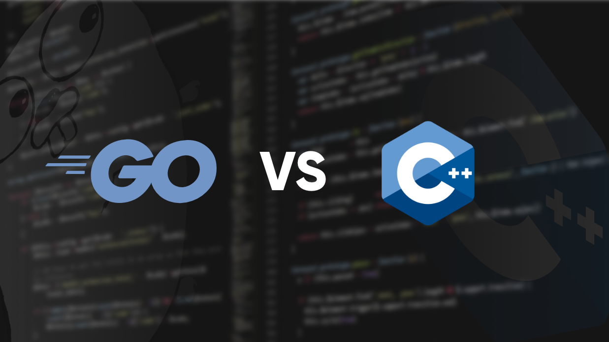

# Futures und Promises

Futures und Promises und deren Umsetzung in verschiedenen Programmiersprachen



> Diese Arbeit wurde von Raphaele Salvatore Licciardo im Rahmen der Modellbasierte Softwareentwicklung Vorlesung an der Hochschule Karlruhe - Technik und Wirtschaft im SS 2021 durchgeführt.  

In diesem Projekt / Thema wird Go und C++ gegenüber gestellt um mit Futures und Promises zu arbeiten. Da es sich um eine Menge verschiedener Code Beispiele handelt darf laut Hr. Sulzmann auch ein Github Repository verwendet werden. Im folgenden wird ausführlich auf die Grundsystematik von Futures und Promises eingegangen. Für die jeweiligen Programmiersprachen gibt es jeweils einen Ordner mit seperaten README Dateien. Diese enthalten dann weiteren Inhalt.

## Inhaltsverzeichnis

- [Futures und Promises](#futures-und-promises)
  - [Inhaltsverzeichnis](#inhaltsverzeichnis)
  - [Futures and Promises](#futures-and-promises)
    - [Funktionsweise](#funktionsweise)
    - [Pseudo Beispiel](#pseudo-beispiel)
  - [Anforderungen](#anforderungen)
  - [Starten des Projektes](#starten-des-projektes)
  - [Kontakt](#kontakt)

## Futures and Promises
Bei der Programmierung stellt Future and Promise einen Platzhalter für ein unbekanntes Ergebnis dar, hauptsächlich weil die Berechnung noch nicht abgeschlossen ist.

Ein Future ist normalerweise das Ergebnis eines asynchronen Aufrufs einer Funktion oder Methode und kann verwendet werden, um sofort auf das Ergebnis zuzugreifen, wenn ein Ergebnis vorliegt. Diese Art der Programmierung ermöglicht eine weitgehend transparente Parallelisierung gleichzeitiger Prozesse. 1977 stellten Henry G. Baker und Carl Hewitt in einem Artikel das Konzept der Zukunft vor.

Die zentrale Idee der Programmierung mit Futures ist, dass Futures als Parameter anderer Prozeduraufrufe übergeben werden können. Die Auswertung dieses Aufrufs kann dann gestartet werden, bevor zukünftige Ergebnisse verfügbar sind. Dies ermöglicht maximale Parallelität. Wenn der neue Anruf asynchron erfolgt, wird dies auch als Pipeline von Futures bezeichnet. Pipeline kann insbesondere in verteilten Anwendungen verwendet werden, um die Verzögerung der Kommunikation zwischen Prozessen zu minimieren.

### Funktionsweise
Futures sind eine Konstruktion der asynchronen Kommunikation zwischen Prozessen. Konzeptionell bietet die Zukunft eine Get- oder Join-Funktion, die blockiert, bis das Ergebnis verfügbar ist und zurückkehrt. Je nach Implementierung kann die Wartezeit durch eine Zeitüberschreitung begrenzt werden, oder es können andere Funktionen verwendet werden, um den aktuellen Status abzufragen.

Wenn Futures direkt in eine Programmiersprache integriert ist, definieren diese normalerweise nur einen asynchronen Zuweisungsoperator, z. B. den Ausdruck `x @= Expression` in Flow Java (einer experimentellen Programmiersprache, die auf Java basiert). Dies bedeutet: Es wird ein Prozess gestartet, um den Ausdruck auf der rechten Seite des Operators auszuwerten, und der der Variable `x` die Zukunft des Ergebnisses zuzuweisen.. Wenn anschließend auf die Variable x zugegriffen wird, wartet das System an dieser Stelle, bis das Ergebnis verfügbar ist.

Die Programmiersprache und Bibliothek, die Futures oder Versprechen unterstützt, ist CORBA (mit asynchronem Methodenaufruf (AMI)) und ab Version 5-Java (Concurrent Class Library) mit gleichzeitigen Dienstprogrammen. Seit ECMAScript 6 stellt JavaScript diese Konstrukte bereit (obwohl es immer noch in eingeschränkter Form vorliegt) ([Quelle](https://developer.mozilla.org/en-US/docs/Web/JavaScript/Reference/Global_Objects/Promise)). C++ bietet auch verschiedene Bibliotheken, von denen die bekannteste Boost ist. Parallelität und Futures können auch in der Standardbibliothek von Standard C++ 11 verwendet werden. Andere Programmiersprachen, die Zukunft und Versprechen unterstützen, sind unter anderem Java, C++, .NET, Python, Swift, Dart, ....

In C# 5.0 und Visual Basic 2013 wird Future implizit über Async verwendet und wartet ([Quelle](https://docs.microsoft.com/en-us/previous-versions/windows/apps/hh464924(v=win.10)?redirectedfrom=MSDN)). Die entsprechende zukünftige Klasse ist in der parallelen Erweiterung definiert, sodass sie auch in früheren Versionen und anderen Programmiersprachen verwendet werden kann. Sie können es jedoch bei Bedarf selbst implementieren. ([Quelle 1](https://docs.microsoft.com/en-us/previous-versions/msp-n-p/ff963556(v=pandp.10)?redirectedfrom=MSDN), [Quelle 2](https://dvanderboom.wordpress.com/2008/07/03/concurrency-with-futures/))

Ein Future ist eine Monade mit einem verwandten Resolver, welcher dem Future einen Wert zuweist. Das Future kann sich in einem von drei Zuständen befinden:

- erfüllt 
- gebrochen 
- wartend 

Wenn der Wert vom Resolver zugewiesen und dadurch bekannt ist, generiert das Future ein Ereignis für welche Rückruffunktionen merkt werden.

### Pseudo Beispiel
Der folgende Pseudo Code zeigt die Verwendung von Futures anhand dem asynchronen Zuweisoperatoren `@=`
```java
  var x @= calc_x();
  var y @= calc_y();
  var z = calc_z();

  var a := x + y + z;
```

> Geht man nun davon aus, das die Berechnung von `x` und `y` noch andauert obwohl der Quellcode bereits an der Berechnung von `a` angekommen ist, würde es zu Fehler kommen. Anhand dem Future and Promise Prinzip wird auf die Berechnung von `a` gewartet.


## Anforderungen
* G++ 10.2.0 (oder drüber)
* Go 1.12.7 (oder drüber)

## Starten des Projektes

Jede verwendete Programmiersprache enthält ein eigenes README, in welcher auf die einzelnen Aspekte näher eingegangen wird.

## Kontakt
Bitte senden Sie eine E-Mail an [Raphaele Licciardo](mailto:lira1011@hs-karlsruhe) für weitere Fragen.